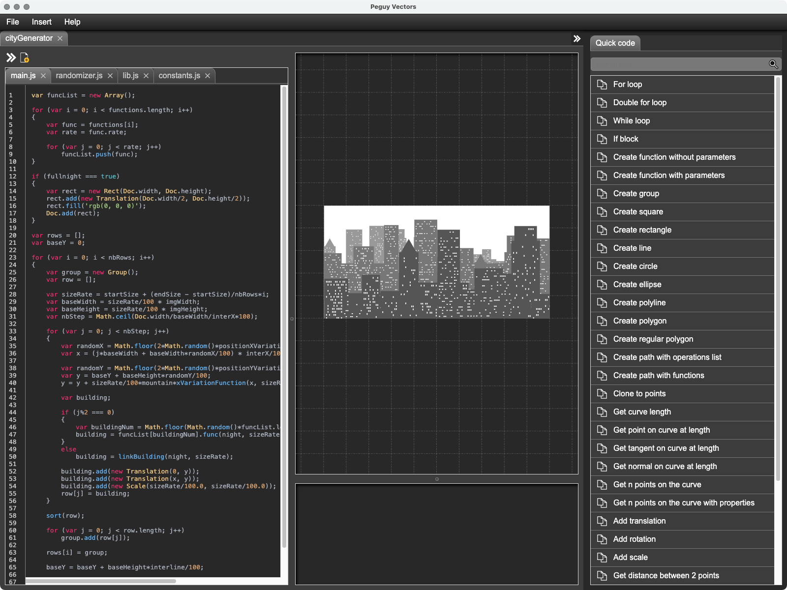

# Péguy Vectors
Péguy Vectors is a vector procedural generation software based on [Electron](https://www.electronjs.org/) and [Péguy.js](https://github.com/Killfaeh/Peguy.js).</br>

Here is an example of what you can do with Péguy Vectors.</br>

<div align="center">

</div></br>

## Table of Contents

1. [Installation](#installation)
2. [How to use](#how-to-use)

## Installation

### Install Node.js

You need to install Node.js to run Péguy Vectors.

**Windows**

Download the installation file on Node.js web site : [https://nodejs.org/fr/download/prebuilt-installer](https://nodejs.org/fr/download/prebuilt-installer) </br>
Run it as administrator.

**Mac OS**

Open a terminal. </br>
Install Homebrew if you haven't already.

```bash
/bin/bash -c "$(curl -fsSL https://raw.githubusercontent.com/Homebrew/install/HEAD/install.sh)"
```

Then, install Node.js and npm.

```bash
brew install node
brew install npm
```

**Linux**

Open a console and run these 2 commands.

```bash
sudo apt install nodejs
sudo apt install npm
```

### Download and extract the archive

Download the project archive via this Google Drive link : [https://drive.google.com/file/d/1KEX9cjaJuSYUl_rfMowsJil0Q7cH_YfW/view?usp=sharing](https://drive.google.com/file/d/1KEX9cjaJuSYUl_rfMowsJil0Q7cH_YfW/view?usp=sharing) </br>
Then, extract it.

<div align="center">
</br>
Archive content
</div>

### Run the application

**Windows**

If you run Péguy Vectors for the first time, run install.bat as administrator. 
A DOS console appears, with a small rotating bar in the top left corner, then disappears when installation is complete.</br>
Then, run PeguyVectors.bat as administrator.

**Mac OS**

If you run Péguy Vectors for the first time, run Install.app (double clic). </br>
Run PeguyVectors.app (double clic).</br>
You can put PeguyVectors.app in your dock.

**Linux**

If you run Péguy Vectors for the first time, run Install in a console. </br>
Run PeguyVectors in a console.

## How to use

### Basics

Here is how look the interface.</br>

<div align="center">

</div></br>

A Péguy Vectors project is a simple javascript file. </br>
To test your program, you just need to click on the left top double arrow.</br>
You can export the result in SVG or PNG format file.</br>
The quick code panel at right help you to write your code faster. 
Double click on the label or simple click on the copy/paste icon of the row which interests you and a code block will be pasted in your code.

### Insert assets

<div align="center">

</div></br>

You can save assets in your asset library by drag and drop SVG files into it.</br>
Then, you can call these assets in your code. 
To do so, select the asset that interests you in the asset library et click on the Ok button. 
The code line which call the asset is pasted in your code.

### Built-in documentation

A documentation is available inside Péguy Vectors. You can read it by clicking on the Help menu.</br>

<div align="center">

</div></br>
