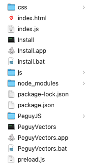

# Péguy Vectors
Péguy Vectors is a vector procedural generation software based on [Electron](https://www.electronjs.org/) and [Péguy.js](https://github.com/Killfaeh/Peguy.js).</br>

<div align="center">

</div></br>

## Table of Contents

1. [Installation](#installation)
2. [How to use](#how-to-use)

## Installation

### Install Node.js

You need to install Node.js to run Péguy Vectors.

**Windows**

Download the installation file on Node.js web site : [https://nodejs.org/fr/download/prebuilt-installer](https://nodejs.org/fr/download/prebuilt-installer) </br>
Run it as administrator.

**Mac OS**

Open a terminal. </br>
Install Homebrew if you haven't already.

```bash
/bin/bash -c "$(curl -fsSL https://raw.githubusercontent.com/Homebrew/install/HEAD/install.sh)"
```

Then, install Node.js and npm.

```bash
brew install node
brew install npm
```

**Linux**

Open a terminal and run these 2 commands.

```bash
sudo apt install nodejs
sudo apt install npm
```

### Download and extract the archive

Download the project archive via this Google Drive link : [https://drive.google.com/file/d/1wx_aKL3e0JKKilcny6_4szz-2vJhlk2W/view?usp=sharing](https://drive.google.com/file/d/1wx_aKL3e0JKKilcny6_4szz-2vJhlk2W/view?usp=sharing) </br>
Then, extract it.

<div align="center">
</br>
Archive content
</div>

### Run the application

**Windows**

If you run Péguy Vectors for the first time, run install.bat (double click).</br>
Then, run PeguyVectors.bat (double click).

**Mac OS**

Run PeguyVectors.app (double click).</br>
You can put PeguyVectors.app in your dock.

**Linux**

Run PeguyVectors in a terminal.

## How to use

### Basics

<div align="center">

</div></br>

### Insert assets

<div align="center">

</div></br>

### Built-in documentation

<div align="center">

</div></br>
